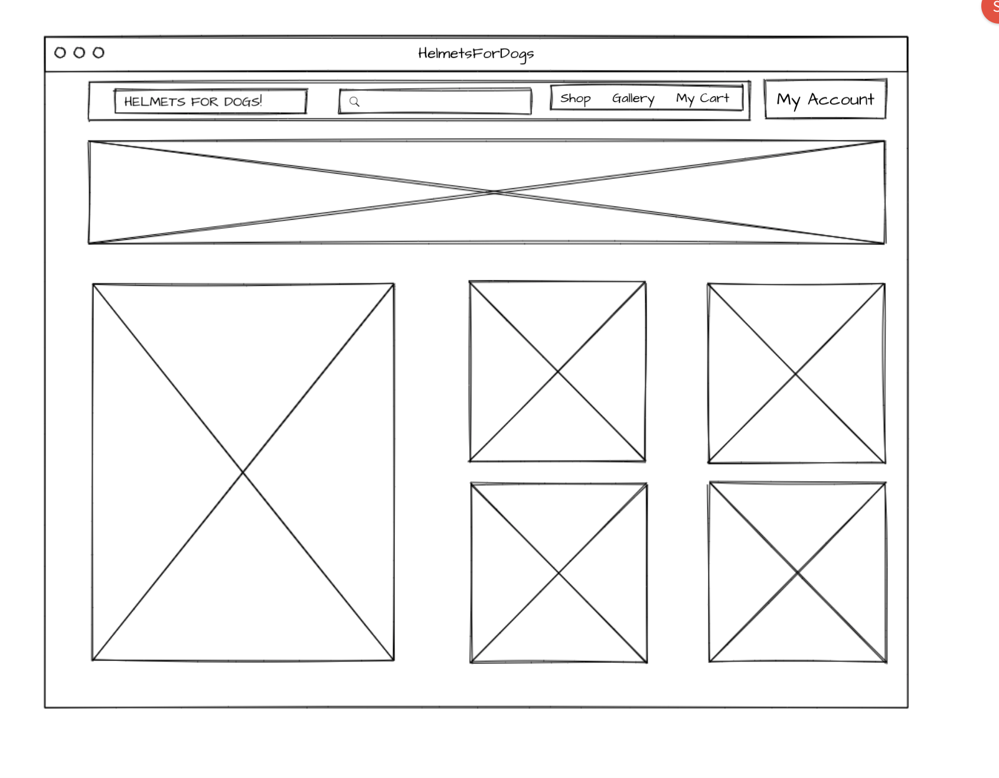
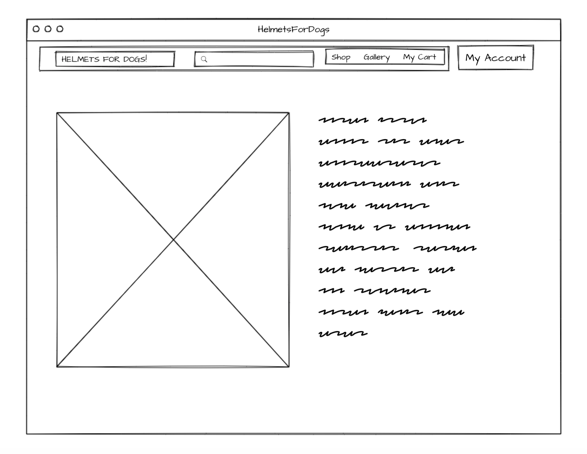
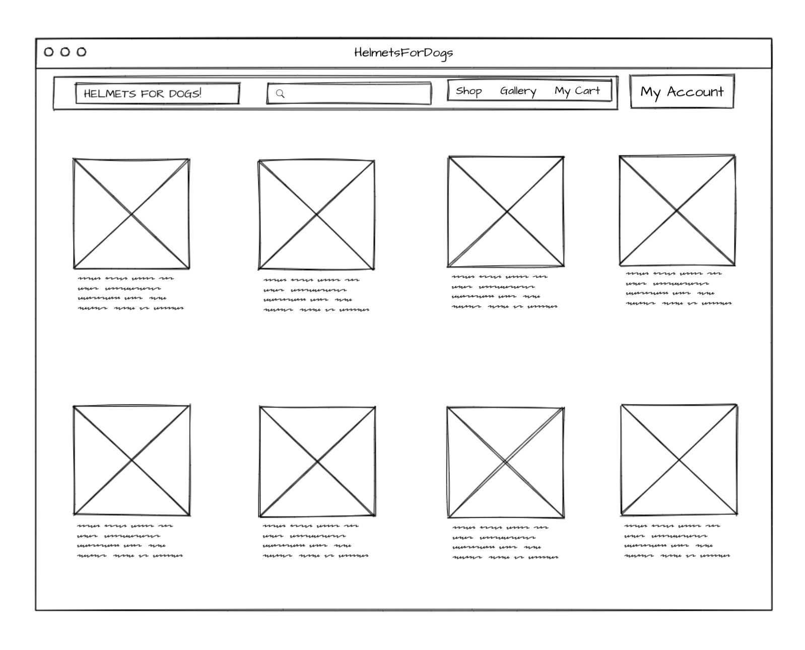
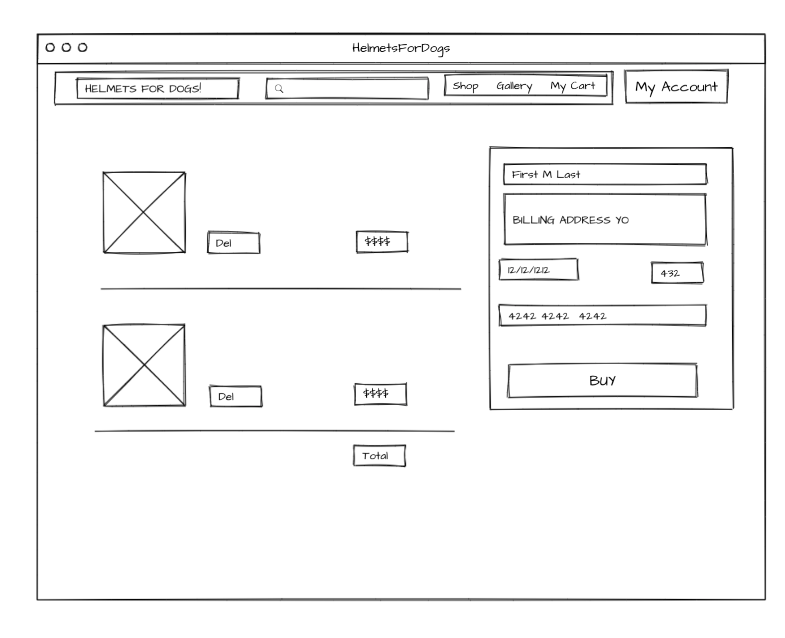

* HELMETSFORDOGS.COM, an e-commerce site that sells arguably the most important dog accessory
* Emily Krauss, party of 1
* React front end, RoR backend, and Stripe for payments

Answer: 
1. https://medium.com/@wintermeyer/authentication-from-scratch-with-rails-5-2-92d8676f6836 and https://medium.com/@luoana.chirita/using-a-ruby-on-rails-backend-with-a-javascript-frontend-ddf25f8f19c6
2. Make a proof of concept for Helmets For Dogs, my million dollar business idea
3. Eccentric billionaires who buy dumb shit for their dogs.
4. Nope

Include Graphics or Links to:
* Gonna setup my backend with users, products, carts, and orders. I'll work on the landing page, and the gallery bc they are easy, then I'll get auth set up so a user can log in, I'll do the product page and populate with my products (we currently have a limited supply of helmets), then I'll do the checkout and payment last.  
* 
* 
* 
* 
* / landing page, gallery links to /gallery, shop links to /products, my cart links to /checkout and submiting payment redirects to / . My Account will also link to /checkout for now. 

